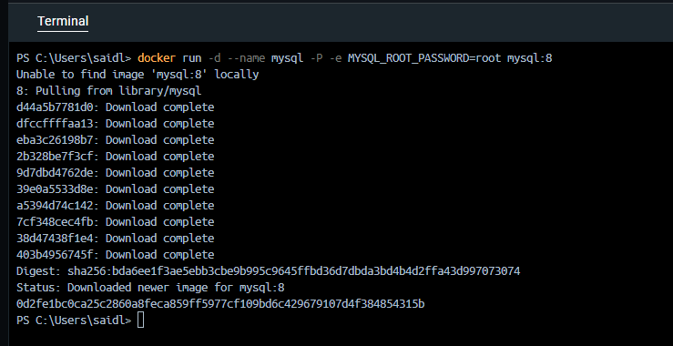

# Variables de Entorno
### ¿Qué son las variables de entorno?

las variables de entorno son valores que se pueden pasar a los contenedores para configurar el entorno de ejecución del software que se ejecuta dentro de ellos. Estas variables permiten modificar el comportamiento de la aplicación sin necesidad de cambiar el código o la imagen del contenedor.

# COMPLETAR

### Para crear un contenedor con variables de entorno?

```
docker run -d --name Practica2 -e username=said -e role=admin nginx:alpine
```


### Crear un contenedor a partir de la imagen de nginx:alpine con las siguientes variables de entorno: username y role. Para la variable de entorno rol asignar el valor admin.

# COMPLETAR

# CAPTURA CON LA COMPROBACIÓN DE LA CREACIÓN DE LAS VARIABLES DE ENTORNO DEL CONTENEDOR ANTERIOR

### Crear un contenedor con mysql:8 , mapear todos los puertos

```
docker run -d --name mysql -P -e MYSQL_ROOT_PASSWORD=root mysql:8 
```



# COMPLETAR

### ¿El contenedor se está ejecutando?

El contenedor de MySQL que se ha creado está en ejecución correctamente, ya que en el estado del comando docker ps -a aparece como "Up About a minute", lo que indica que el contenedor está funcionando sin problemas.


### Eliminar el contenedor creado con mysql:8 


# COMPLETAR

### Para crear un contenedor con variables de entorno especificadas
- Portabilidad: Las aplicaciones se vuelven más portátiles y pueden ser desplegadas en diferentes entornos (desarrollo, pruebas, producción) simplemente cambiando el archivo de variables de entorno.
- Centralización: Todas las configuraciones importantes se centralizan en un solo lugar, lo que facilita la gestión y auditoría de las configuraciones.
- Consistencia: Asegura que todos los miembros del equipo de desarrollo o los entornos de despliegue utilicen las mismas configuraciones.
- Evitar Exposición en el Código: Mantener variables sensibles como contraseñas, claves API, y tokens fuera del código fuente reduce el riesgo de exposición accidental a través del control de versiones.
- Control de Acceso: Los archivos de variables de entorno pueden ser gestionados con permisos específicos, limitando quién puede ver o modificar la configuración sensible.

Previo a esto es necesario crear el archivo y colocar las variables en un archivo, **.env** se ha convertido en una convención estándar, pero también es posible usar cualquier extensión como **.txt**.
```
docker run -d --name mysql --env-file="C:\Users\saidl\Desktop\EPN\6 Semestre\Construcción y Evolución de Software\Práctica 2\mysql.env" -P mysql:8

```

**Considerar**
Es necesario especificar la ruta absoluta del archivo si este se encuentra en una ubicación diferente a la que estás ejecutando el comando docker run.

### Crear un contenedor con mysql:8 , mapear todos los puertos y configurar las variables de entorno mediante un archivo
# COMPLETAR


# CAPTURA CON LA COMPROBACIÓN DE LA CREACIÓN DE LAS VARIABLES DE ENTORNO DEL CONTENEDOR ANTERIOR 


### ¿Qué bases de datos existen en el contenedor creado?

Para listar las bases de datos en el contenedor de MySQL, primero es necesario conectarse al servicio de MySQL que se está ejecutando dentro del contenedor.

```
docker exec -it mysql mysql -u root -p

```

Una vez dentro del cliente MySQL se ingresa la contraseña root cuando la solicite.
Después, para listar las bases de datos existentes se escribe el  siguiente comando SQL:

```
SHOW DATABASES;

```


