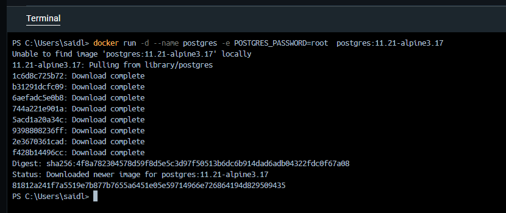
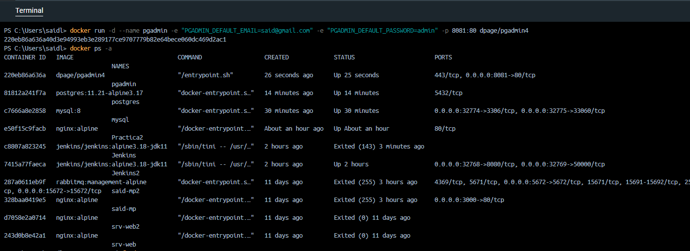
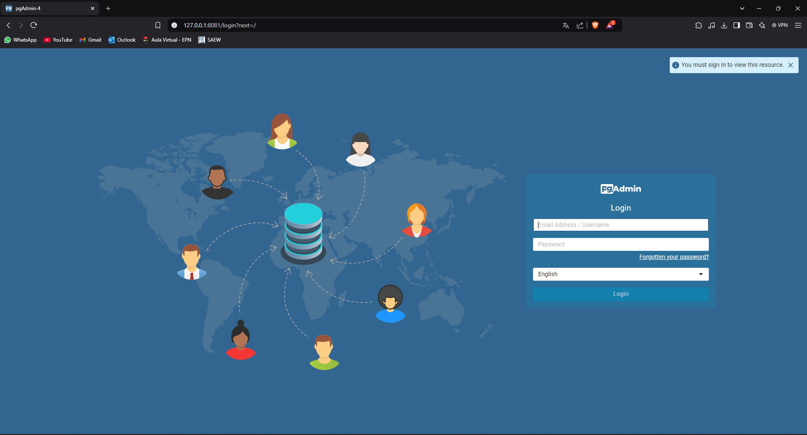
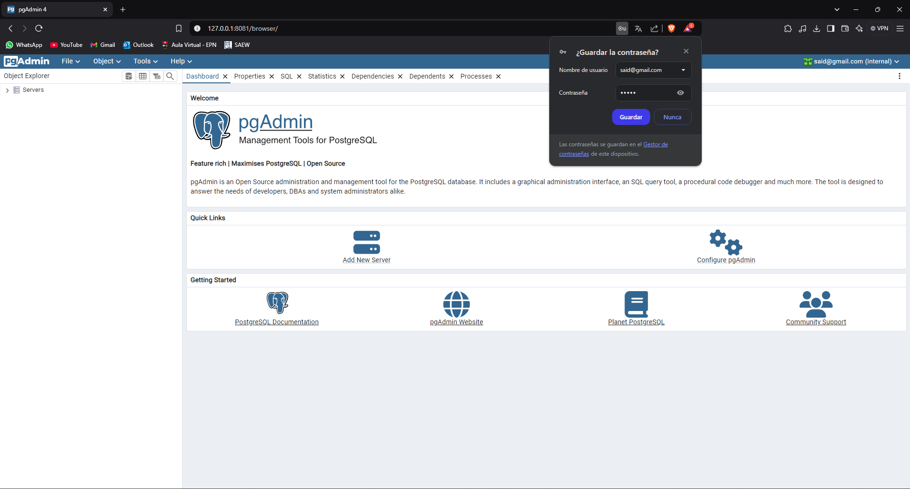
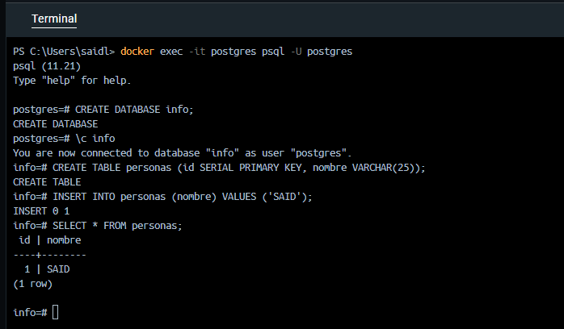

### Crear contenedor de Postgres sin que exponga los puertos. Usar la imagen: postgres:11.21-alpine3.17

```
docker run -d --name postgres -e POSTGRES_PASSWORD=root  postgres:11.21-alpine3.17
```
Al omitir la opción de puertos -P o -p, el contenedor no expondrá ningún puerto al host, lo que significa que no se podrá acceder desde el exterior del contenedor. 



# COMPLETAR

### Crear un cliente de postgres. Usar la imagen: dpage/pgadmin4

```
docker run -d --name pgadmin-container -e "PGADMIN_DEFAULT_EMAIL=said@gmail.com" -e "PGADMIN_DEFAULT_PASSWORD=admin" -p 8081:80 dpage/pgadmin4 
```


# COMPLETAR

La figura presenta el esquema creado en donde los puertos son:
- a: (8081)
- b: (5432)
- c: (5432)


## Desde el cliente
### Acceder desde el cliente al servidor postgres creado.
Para acceder al cliente se tuvo que configurar el puerto 8081 para el contenedor, debido a que se configuró un container Jenkins con el puerto 8080.





# COMPLETAR CON UNA CAPTURA DEL LOGIN
### Crear la base de datos info, y dentro de esa base la tabla personas, con id (serial) y nombre (varchar), agregar un par de registros en la tabla, obligatorio incluir su nombre.

## Desde el servidor postgresl
### Acceder al servidor
### Conectarse a la base de datos info
# COMPLETAR
### Realizar un select *from personas
# AGREGAR UNA CAPTURA DE PANTALLA DEL RESULTADO


