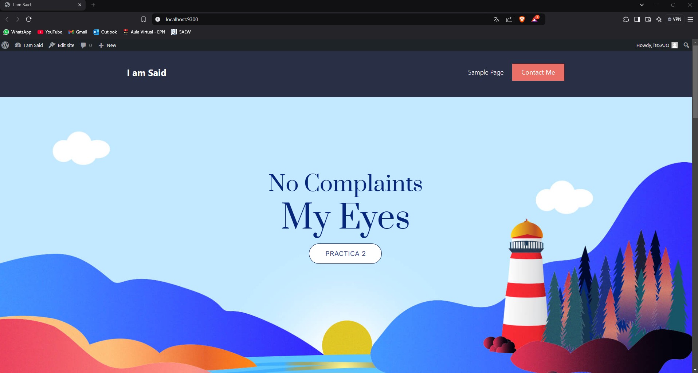

## Esquema para el ejercicio


### Crear la red
```
docker network create E5 -d bridge
```


# COMPLETAR

### Crear el contenedor mysql a partir de la imagen mysql:8, configurar las variables de entorno necesarias

```
docker run -d --name mysql --env-file="C:\Users\saidl\Desktop\EPN\6 Semestre\Construcción y Evolución de Software\Práctica 2\mysql.env" -P mysql:8
```


# COMPLETAR

### Crear el contenedor wordpress a partir de la imagen: wordpress, configurar las variables de entorno necesarias
# COMPLETAR


De acuerdo con el trabajo realizado, en la el esquema de ejercicio el puerto a es **(9300)**

Ingresar desde el navegador al wordpress y finalizar la configuración de instalación.


# COLOCAR UNA CAPTURA DE LA CONFIGURACIÓN

Desde el panel de admin: cambiar el tema y crear una nueva publicación.
Ingresar a: http://localhost:9300/ 
recordar que a es el puerto que usó para el mapeo con wordpress
# COLOCAR UNA CAPTURA DEL SITO EN DONDE SEA VISIBLE LA PUBLICACIÓN.



### Eliminar el contenedor wordpress
# COMPLETAR


### Crear nuevamente el contenedor wordpress
Ingresar a: http://localhost:9300/ 
recordar que a es el puerto que usó para el mapeo con wordpress


### ¿Qué ha sucedido, qué puede observar?
# COMPLETAR

La página en blanco que estás viendo probablemente se debe a una discrepancia en la configuración entre WordPress y MySQL, específicamente en las variables de entorno como WORDPRESS_DB_HOST, WORDPRESS_DB_USER, WORDPRESS_DB_PASSWORD, y WORDPRESS_DB_NAME. Dado que en la configuración de WordPress estás intentando conectarte a una base de datos y un usuario que no coinciden con los definidos en MySQL, WordPress no puede acceder correctamente a la base de datos. 


